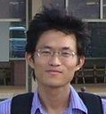

<table style="border: 0; cellpadding: 10; vertical-align: top;">
  <tr>
    <td>
      
    </td>
    <td></td>
    <td>
      <b>Jae-Yeong Lee</b> 
      <b>Ph.D.</b>  
      Principal Research Scientist 
      <a href="https://www.etri.re.kr/">Electronics and Telecommunications Research Institute (ETRI)</a>  
      Professor 
      <a href="https://www.ust.ac.kr/">University of Science and Technology</a>  
      <b>Contact</b>: <a href="mailto:jylee@etri.re.kr">jylee-at-etri.re.kr</a>
    </td>
  </tr>
</table> 

I received my BS in mathematics and MS, PhD in computer science and engineering from Seoul National University, Rep. of Korea, in 1996, 1998 and 2005, respectively. I am currently working for Electronics and Telecommunications Research Institute, Daejeon, Rep. of Korea. I also have been with the Department of Artificial Intelligence, University of Science and Technology, Daejeon, Rep. of Korea. My research interests include computer vision, visual object tracking, camera calibration, and robot navigation.

## News
